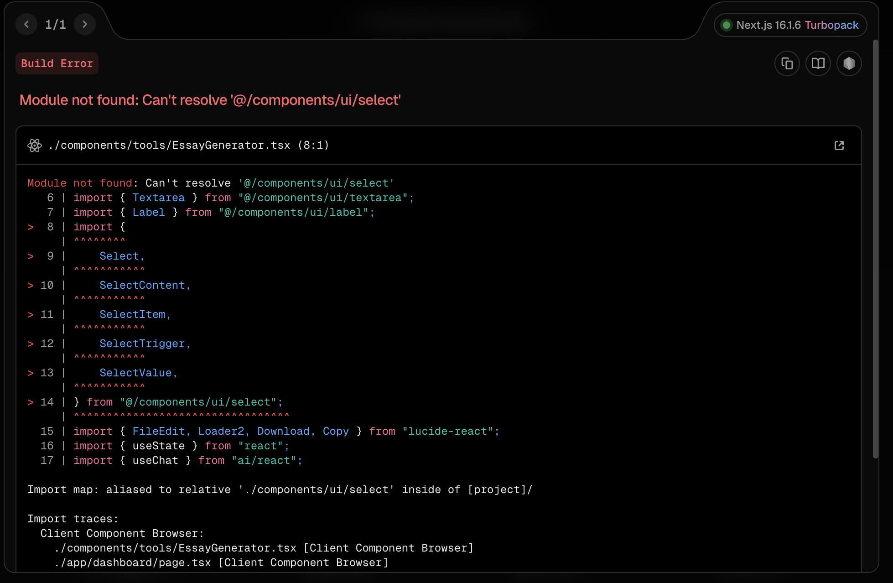

# 🎉 PRISMA AI - Implementación Completa

## ✅ TODO IMPLEMENTADO Y FUNCIONAL

### 📍 **Cómo Acceder a las Nuevas Funcionalidades**

1. **Página Principal**: `http://localhost:3000`
   - Nuevo diseño con hero section
   - Grid de características
   - Botones para ir al Dashboard y About

2. **Dashboard Principal**: `http://localhost:3000/dashboard`
   - **8 pestañas funcionales**:
     - 📊 Dashboard - Estadísticas y progreso
     - 📚 Biblioteca - Organizar documentos por asignaturas
     - 🏆 Logros - Sistema de gamificación
     - 🔍 Buscar - Búsqueda inteligente
     - ✍️ Ensayos - Generador de ensayos
     - 🌐 Traductor - Traducción multiidioma
     - 📅 Planificador - Planificador de estudio
     - 📈 Análisis - Análisis de rendimiento

3. **Página About**: `http://localhost:3000/`
   - Información completa sobre PRISMA AI
   - Características, misión y valores
   - Estadísticas y CTA

4. **Workspace**: `http://localhost:3000/workspace/[id]`
   - Nueva pestaña "Notes" en Study Aids
   - Botón "Exportar" al final del panel
   - Todas las funcionalidades anteriores funcionando

---

## 🎯 **Funcionalidades Implementadas**

### **Top 5 Prioridad** ✅

1. ✅ **Dashboard con Estadísticas**
   - Contador de documentos, mensajes, resúmenes, podcasts, flashcards, exámenes
   - Racha de días consecutivos
   - Tiempo de estudio semanal
   - Persistencia en localStorage

2. ✅ **Sistema de Notas**
   - Crear, editar y eliminar notas
   - Asociadas a documentos específicos
   - Timestamps automáticos
   - Integrado en el workspace

3. ✅ **Gamificación**
   - Sistema de puntos yabout niveles
   - Barra de progreso al siguiente nivel
   - 5 logros desbloqueables
   - Racha de días con emoji 🔥

4. ✅ **Biblioteca con Carpetas**
   - Crear asignaturas con iconos y colores
   - Organizar documentos por asignaturas
   - Filtrar y buscar documentos
   - Eliminar asignaturas y documentos

5. ✅ **Guardar Progreso**
   - Hook `useStudyProgress` para tracking
   - Funciones `awardPoints()` y `updateStats()`
   - Integración con gamificación
   - LocalStorage para persistencia

### **Puntos 6-14** ✅

6. ✅ **Temas Personalizables**
   - Modo oscuro/claro/sistema
   - Toggle en el header del dashboard
   - Integrado con next-themes

7. ✅ **Búsqueda Inteligente**
   - Búsqueda en tiempo real
   - Buscar en títulos, contenido y notas
   - Resultados con snippets
   - Navegación directa a documentos

8. ✅ **Dashboard** (Ya en Top 5)

9. ✅ **Generador de Ensayos**
   - 4 tipos: argumentativo, expositivo, narrativo, descriptivo
   - Longitud configurable (300-1000 palabras)
   - Streaming en tiempo real
   - Copiar y descargar

10. ✅ **Traductor**
    - 10 idiomas soportados
    - Auto-detección de idioma
    - Intercambio de idiomas
    - Copiar traducción

11. ✅ **Reconocimiento de Voz**
    - Componente `VoiceInput` listo para integrar
    - Web Speech API
    - Animación de micrófono

12. ✅ **Planificador de Estudio**
    - Crear sesiones programadas
    - Marcar como completadas
    - Estadísticas de horas
    - Vista de próximas y completadas

13. ✅ **Exportación Avanzada**
    - Exportar a TXT, Markdown, JSON
    - Incluye todo el contenido
    - Integrado en workspace

14. ✅ **Análisis de Rendimiento**
    - Puntuación general
    - Tendencia (subiendo/bajando)
    - Gráfico de actividad semanal
    - Áreas fuertes y débiles
    - Recomendaciones personalizadas

---

## 🚀 **Cómo Usar**

### **1. Ir al Dashboard**
```
http://localhost:3000/dashboard
```

### **2. Explorar las Pestañas**
- Cada pestaña tiene una funcionalidad completa
- Todo se guarda automáticamente en localStorage
- No necesitas cuenta ni login

### **3. Crear tu Primera Asignatura**
1. Ve a la pestaña "Biblioteca"
2. Click en "Nueva Asignatura"
3. Elige nombre, icono y color
4. ¡Listo!

### **4. Generar un Ensayo**
1. Ve a la pestaña "Ensayos"
2. Escribe el tema
3. Selecciona tipo y longitud
4. Click en "Generar Ensayo"
5. Espera el streaming en tiempo real

### **5. Traducir Texto**
1. Ve a la pestaña "Traductor"
2. Escribe o pega el texto
3. Selecciona idioma destino
4. Click en "Traducir"

### **6. Planificar Estudio**
1. Ve a la pestaña "Planificador"
2. Añade sesiones con fecha y hora
3. Marca como completadas
4. Ve tus estadísticas

### **7. Ver tu Progreso**
1. Ve a la pestaña "Dashboard"
2. Ve todas tus estadísticas
3. Revisa tu racha de días

### **8. Análisis de Rendimiento**
1. Ve a la pestaña "Análisis"
2. Ve tu puntuación general
3. Identifica áreas fuertes y débiles
4. Lee recomendaciones personalizadas

---

## 🎨 **Características de UI/UX**

- ✅ Diseño responsive (móvil y desktop)
- ✅ Modo oscuro/claro
- ✅ Animaciones suaves
- ✅ Iconos de Lucide
- ✅ Componentes de shadcn/ui
- ✅ Gradientes y glassmorphism
- ✅ Badges y estados visuales
- ✅ Loading states
- ✅ Error handling

---

## 💾 **Persistencia de Datos**

Todo se guarda en **localStorage**:
- `prisma-subjects` - Asignaturas
- `prisma-documents` - Documentos
- `prisma-stats` - Estadísticas
- `prisma-gamification` - Gamificación
- `notes-{documentId}` - Notas por documento
- `progress-{documentId}` - Progreso
- `study-sessions` - Sesiones de estudio
- `last-active-date` - Última actividad
- `previous-score` - Puntuación anterior

---

## 🔧 **Dependencias Instaladas**

- ✅ `next-themes` - Para modo oscuro/claro

---

## 📝 **Próximos Pasos Sugeridos**

1. Integrar `VoiceInput` en el `ChatInterface`
2. Añadir más logros desbloqueables
3. Implementar notificaciones para logros
4. Añadir gráficos más avanzados (Recharts)
5. Migrar de localStorage a IndexedDB para más capacidad
6. Añadir sincronización en la nube
7. Crear app móvil nativa

---

## 🎓 **¡TODO ESTÁ LISTO PARA USAR!**

Navega a `http://localhost:3000` y empieza a explorar todas las nuevas funcionalidades.

**¡Disfruta de PRISMA AI! 🚀**
